# IoT Automatic Egg Incubator

 The IoT Automatic Egg Incubator is similar to the type of incubator which can be used as a substitute of poultry chicken to incubate the chicken eggs automatically. It will be helpful for the farmers to incubate their eggs automatically without the need of human intervention, by keeping the physical quantities such as temperature and humidity at required level, so that the fetuses inside them will grow and incubates without the presence of mother.
 This project is made up of Hardware and Mobile app. The Pictures for Hardware  will be uploaded soon as the project is near completion.
## Getting Started

The Following Flutter packages were so far used:
 - syncfusion_flutter_charts: ^18.1.48
 - path_provider: ^1.6.5
 - sqflite: ^1.3.0
 - flutter_bluetooth_serial: ^0.2.2
 - getflutter: ^1.0.11
 - csv: ^4.0.3
 - permission_handler: ^5.0.0+hotfix.9
 - ext_storage: ^1.0.3
 - open_file: ^3.0.1

 ## Mobile App Screenshot
 Here Are the screenshot for the mobile app

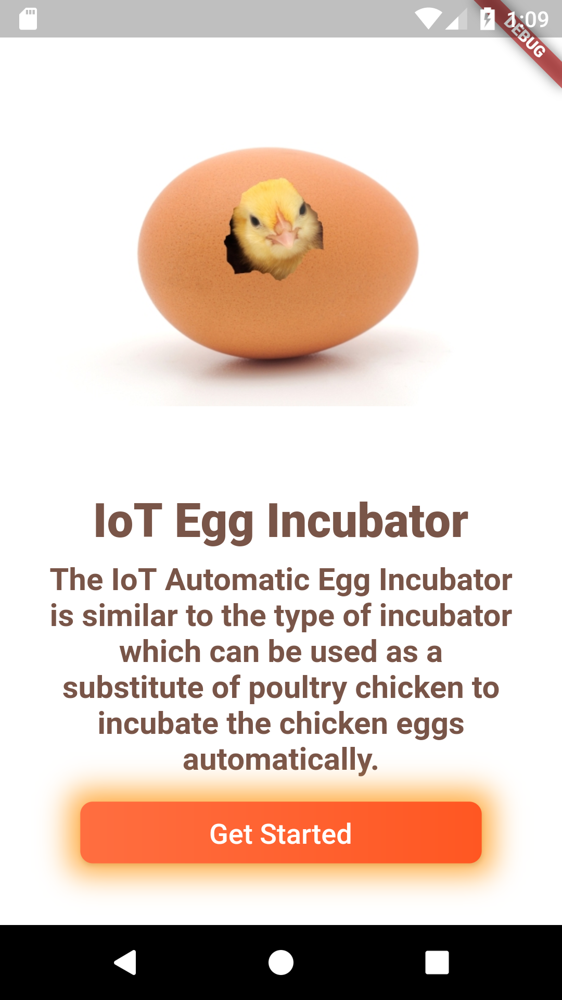  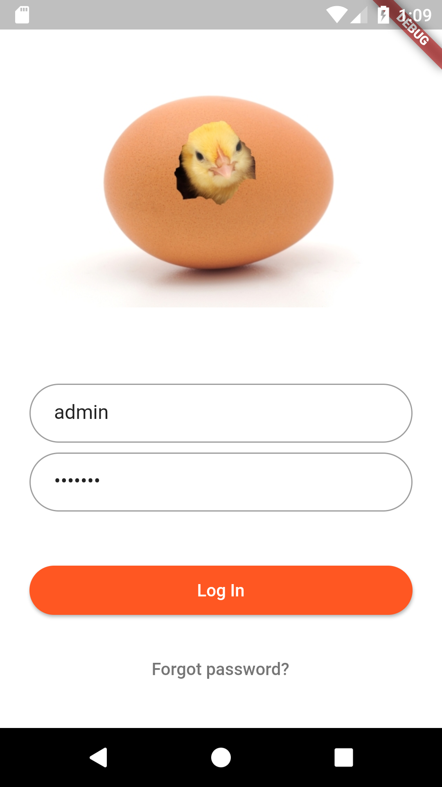 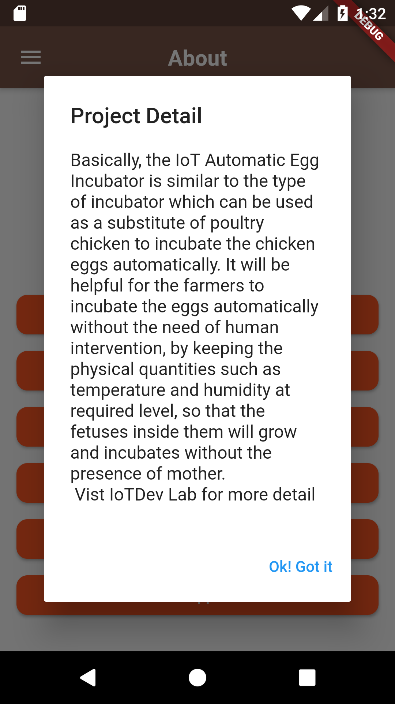

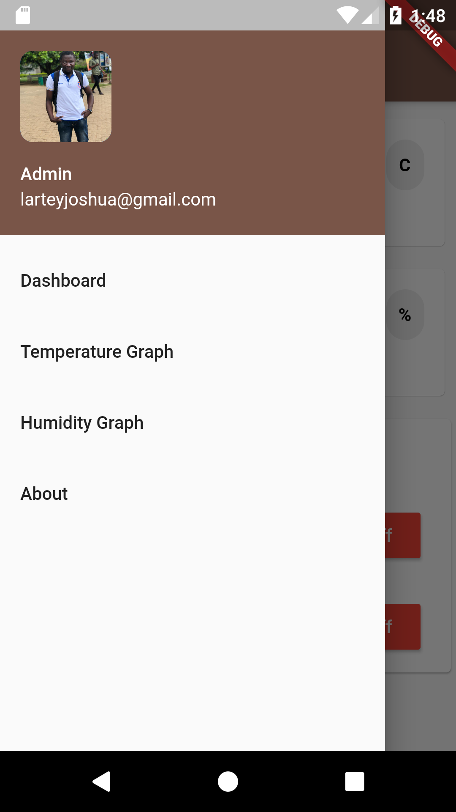 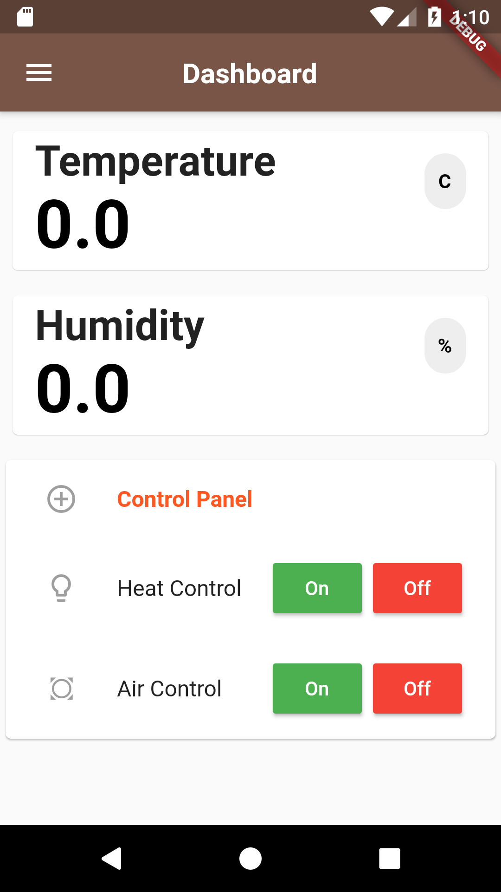 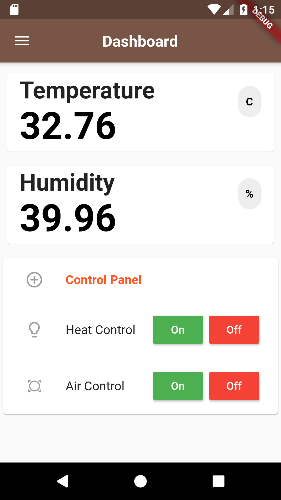

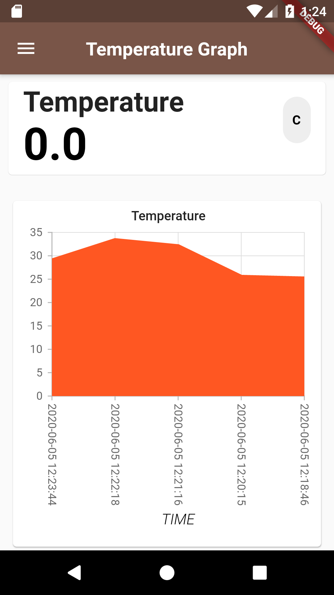  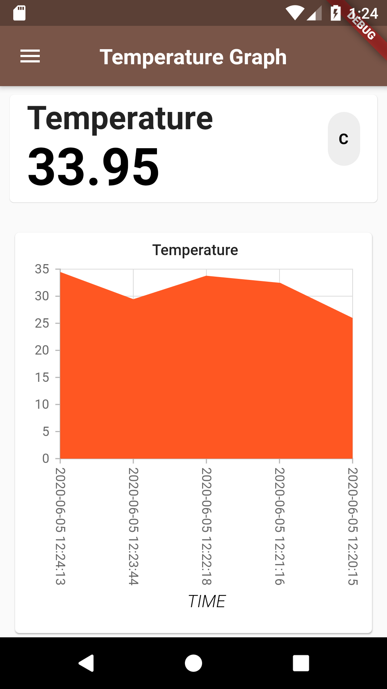 

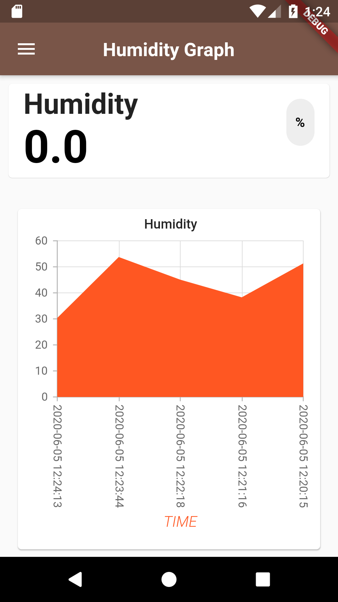  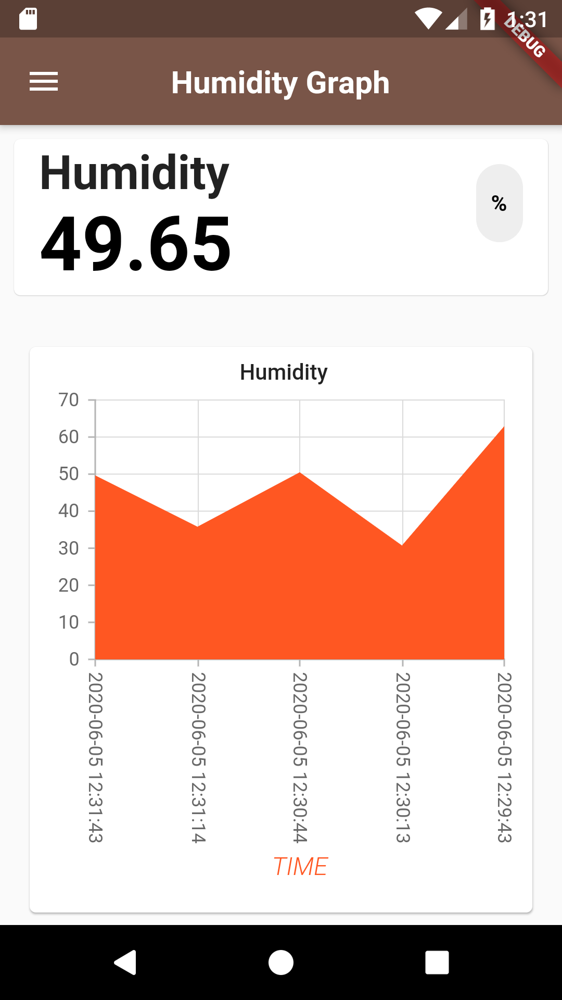 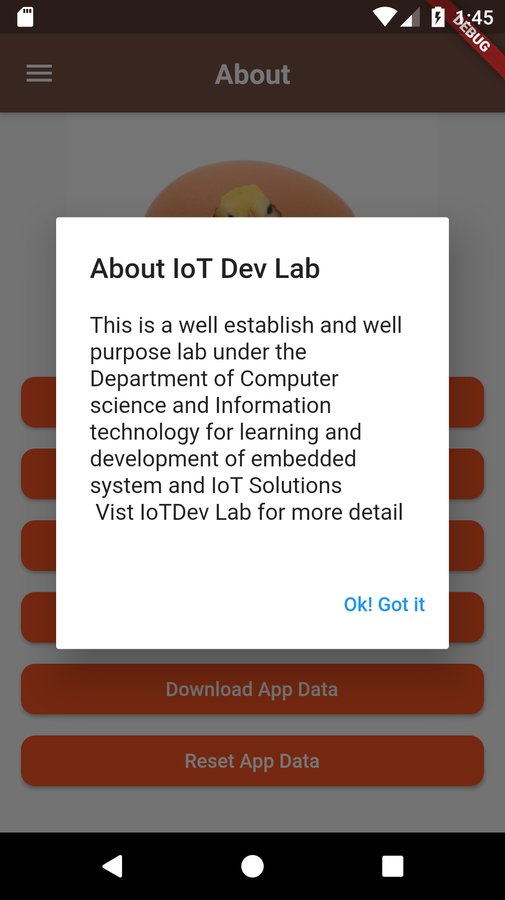

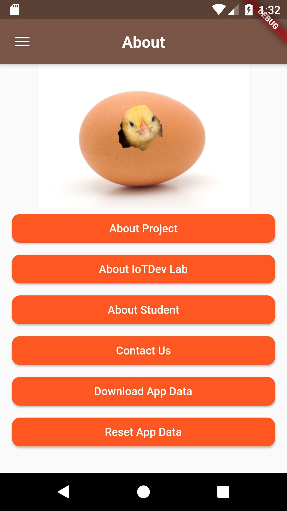  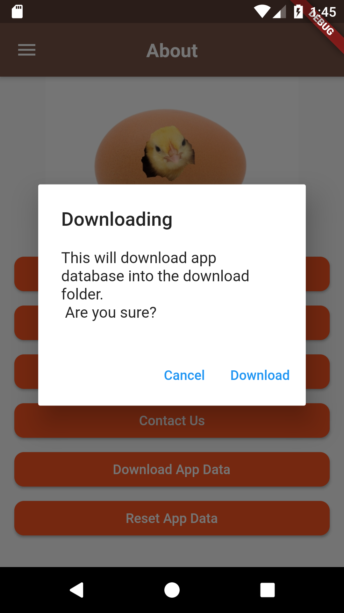 

A few resources to get you started if this is your first Flutter project:

- [Lab: Write your first Flutter app](https://flutter.dev/docs/get-started/codelab)
- [Cookbook: Useful Flutter samples](https://flutter.dev/docs/cookbook)

For help getting started with Flutter, view our
[online documentation](https://flutter.dev/docs), which offers tutorials,
samples, guidance on mobile development, and a full API reference.
